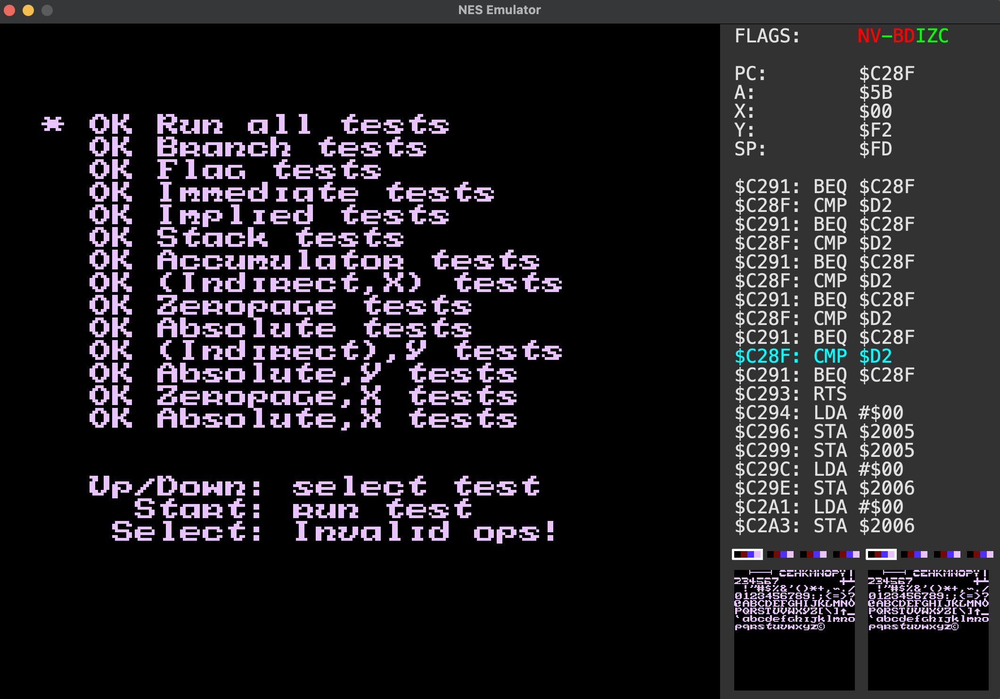

# NES-Emulator

A Nintendo Entertainment System (NES) emulator implemented in C++ with a Qt6-based GUI. This project targets correct and functional emulation of the NES hardware.


*Running nestest.nes test ROM with the debug window enabled, successfully passing all CPU instruction tests*

## Features

- Accurate CPU emulation (Supports all official 6502 opcodes)
- PPU (Picture Processing Unit) emulation
- APU (Audio processing Unit) emulation
- Support for many of the most popular mappers:
  - NROM (Mapper 0)
  - MMC1 (Mapper 1)
  - UxROM (Mapper 2)
  - CNROM (Mapper 3)
  - MMC3 (Mapper 4)
  - AxROM (Mapper 7)
  - MMC2 (Mapper 9)
  - GxROM (Mapper 66)
- Debug window for development and testing
  - CPU instruction disassembly and register
  viewer
  - PPU pattern table and palette viewer
  - Step-by-step execution control
- Save states


## Prerequisites

- CMake (version 3.21.1 or higher)
- C++17 compatible compiler
- Qt6 development libraries
  - Core
  - Gui
  - Multimedia
  - Widgets
- Git (for cloning the repository)

## Building from Source

### macOS/Linux
1. Clone the repository:
```bash
git clone https://github.com/kfg021/NES-Emulator.git
cd NES-Emulator
```

2. Obtain Qt6 development libraries:
   If you don't have Qt6 installed, the easiest ways are:
   *   On **macOS** using Homebrew:
      ```bash
      brew install qt
      ```
   *   On **Debian/Ubuntu**:
      ```bash
      sudo apt update
      sudo apt install qt6-base-dev qt6-multimedia-dev
      ```
   *   For other distributions or if you prefer, use the **Qt online installer for open source development** from the official Qt website ([https://www.qt.io/download-qt-installer-oss](https://www.qt.io/download-qt-installer-oss)). Ensure you select a Qt6 version (e.g., Qt 6.7.3), and the necessary modules (Qt Base, Qt Multimedia).

3. Create a build directory and navigate to it:
```bash
mkdir build
cd build
```

4. Generate build files with CMake:
```bash
cmake -DCMAKE_BUILD_TYPE=Release ..
```

5. Build the project:
```bash
make
```

### Windows (Visual Studio)
1. Prerequisites:
   - Visual Studio with C++ development workload
   - CMake 3.21.1 or later
   - Git
   - **Qt6 SDK:** Download and install using the **Qt online installer for open source development** ([https://www.qt.io/download-qt-installer-oss](https://www.qt.io/download-qt-installer-oss)). Ensure you select a Qt6 version (e.g., Qt 6.7.3), the necessary modules (Qt Base, Qt Multimedia), and the kit corresponding to your Visual Studio version (e.g., MSVC 2022 64-bit).

2. Clone the repository:
```cmd
git clone https://github.com/kfg021/NES-Emulator.git
cd NES-Emulator
```

3. Set up Qt Environment:
   - Ensure Qt's installation directory (specifically the `bin` folder containing `qmake.exe`) is added to your system's PATH environment variable.
   - Set the `Qt6_DIR` environment variable to point to your Qt installation (e.g., `C:\Qt\6.7.3\msvc2022_64`). Visual Studio's CMake integration often relies on this.

4. Generate Visual Studio solution:
   - Open Visual Studio
   - Select "Open a local folder" and choose the cloned repository
   - Visual Studio will automatically detect the CMakeLists.txt and configure the project

5. Build the project:
   - Select Release configuration
   - Build -> Build All
   - The executable will be generated in the `out/build/x64-Release` directory

Note: If CMake has trouble finding Qt, you may need to specify the Qt6_DIR path explicitly:
```cmd
cmake -B build -S . -DQt6_DIR="C:\Path\To\Your\Qt\6.7.3\msvc2022_64\lib\cmake\Qt6"
```

## Usage

### Running the Emulator

You can launch the emulator in a few ways:

1. Without a ROM file:
```bash
./NES_Emulator
```
*(Replace ./NES_Emulator with NES_Emulator.exe on Windows)*

This will open a file selector dialog to select a ROM file.

2. With a ROM file as a command-line argument:
```bash
./NES_Emulator path/to/your/game.nes
```

3. With a ROM file and a save state file:
```bash
./NES_Emulator path/to/your/game.nes path/to/your/save.sstate
```

### ROM Support
- Only .nes files with iNES header format are supported
- The emulator will verify the ROM header before loading
- Supported mappers are listed in the Features section above

### Save States
- Save states use a proprietary .sstate format and can only be created using this emulator

### Output
The emulator window will show:
- Main game window
- Debug window (if enabled with 'D' key) showing:
  - CPU state and registers
  - Current instruction and next instructions
  - Pattern tables / Palettes

### Controls

#### Emulator controls
- Arrow keys: D-pad
- Z: B button
- X: A button
- Return/Enter: Start
- Shift: Select

#### Menu controls
- R: Reset game
- C: Pause/Unpause game
- M: Toggle sound
- D: Toggle debug window
- S: Create save state (opens file dialog to choose location)
- L: Load save state (opens file dialog to choose file)
- K: Quick load save state (loads most recently saved/loaded file)

#### Debug window controls (when open)
- Space (If paused): Step to next instruction
- O: Cycle background palette
- P: Cycle sprite palette

## Testing

The emulator can be tested using the `nestest.nes` ROM, which is a comprehensive test ROM for verifying CPU instruction accuracy:

```bash
./NES_Emulator nestest.nes
```

This ROM will automatically run through all CPU instructions and verify their correct implementation.

## Code Structure

The emulator is structured into several key components:

- `Bus`: Main system bus that connects all components
- `CPU`: MOS Technology 6502 processor emulation
- `PPU`: Picture Processing Unit for graphics
- `APU`: Audio processing unit
- `Cartridge`: ROM loading and memory management
- `Controller`: Input handling
- Various Mapper implementations for different game cartridge types

## Future Work

The following features and improvements are planned for future development:

### Core Emulation
- Additional mapper support
- Complete iNES 2.0 format support
- Support for undocumented 6502 CPU opcodes
- Support for second controller
- Support for NES accessories (i.e. Zapper light gun)

### Platform Support
- Web browser support using Emscripten

### Performance Optimizations
- CPU/PPU cycle accuracy improvements
- Frame timing optimizations

### User Experience
- Recording/replay functionality
- Controller/Gamepad key button support

## Contributing

1. Fork the repository
2. Create a feature branch (`git checkout -b feature/new-feature`)
3. Commit your changes (`git commit -m 'Add some feature'`)
4. Push to the branch (`git push origin feature/new-feature`)
5. Open a Pull Request

## License

This project (NES-Emulator) is licensed under the MIT License. See the [LICENSE](LICENSE) file for the full text.

## Third-Party Libraries & Licensing

### Qt6 Framework

This project utilizes the Qt6 framework. The Qt6 modules used in this project (Core, Gui, Multimedia, Widgets) are licensed under the GNU Lesser General Public License v.3 (LGPLv3).

- A copy of the LGPLv3 is included in this repository as [LICENSE.LGPLv3](LICENSE.LGPLv3). It is recommended to include a copy of this license with any distributed binaries of this application.
- The source code for the Qt libraries can be obtained from the official Qt Company website: [https://download.qt.io/archive/qt/](https://download.qt.io/archive/qt/).
- In compliance with the LGPLv3, users of this application have the right to modify and re-link the Qt libraries. This application is dynamically linked against Qt to facilitate this.

## Acknowledgments
- [NESDev Wiki](http://wiki.nesdev.com/) - Comprehensive documentation of NES hardware
- [6502.org](http://6502.org/) - In-depth information about the 6502 CPU
- [Javidx9](https://www.youtube.com/watch?v=nViZg02IMQo&list=PLrOv9FMX8xJHqMvSGB_9G9nZZ_4IgteYf) - Extremely useful NES Emulator tutorial series
- [NESHacker](https://www.youtube.com/@NesHacker) - Excellent NES development tutorials and open-source test ROMs